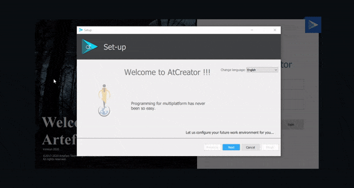

---
tags:
  - Artefact
  - Installation
  - Setting
---

# Installation
::: danger
Currently Artefact-Creator is only disponible on Windows
:::

## Download Artefact-creator
1. Go to the official website of [Artefact-Labs]()
2. Create an account and Login
3. Download the executor

## Install
Just follow the steps explained in the installation's wizards.

## Configuration
When the installtion will be done, open the tool
Lorsque l' installation sera terminée, ouvrez le logiciel.

Lord de la première ouverture une fenetre de configuration s' ouvrira. Elle vous permet de realiser les configurations de base de l' IDE.

1. Choose the language
2. Choose the software you don' t have. They will be installed (offline).
3. Choose a theme for your IDE. Artefact-Creator offer you 3 different theme.
4. Configure a user account (username, password). you will use it to open the IDE.
