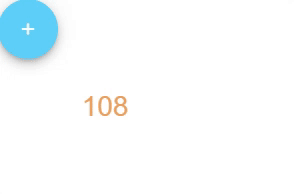

---
tags:
  - data
  - script
  - property
  - state
---
# Method

## Detailed description
Methods to be mixed into the Vue instance. You can access these methods directly on the VM instance, or use them in directive expressions. All methods will have their this context automatically bound to the Vue instance.

## Example usage
The following example shows the simplest usage of the Method type.



<code-group>
<code-block title=".at">
```scss
Item{  
  id: "example",
  width: 365,
  height: 300,
  x: 0,
  y: 0,
  child: [
    Text{     
      id: "textexample3",
      width: 100,
      height: 100,
      x: 57,
      y: 58,
      value: "<#count#>",
      horizontalAlign: "center",
      verticalAlign: "center",
      fontSize: 28,
      color: "#eaa161"
    },
    Button{     
      id: "buttonexample3",
      width: 80,
      height: 80,
      x: 0,
      y: 0,
      fab: true,
      onClicked: "increment",
      dark: true,
      backgroundColor: "#8cb2ef",
      icon: "ion-ios-add",
      hasIcon: true
    }
  ]
}, 
```
</code-block>

<code-block title=".atObj" active>
```js
Data count = 100

Method increment () { 
	this.count++;
}
```
</code-block>

<code-block title=".atStyle">
```scss
```
</code-block>
</code-group>