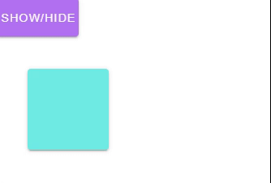

---
tags:
  - animation
  - ui
  - element
---
# Transition

## Detailed description
The transition allows you to associate with an element animation for different events.

## Example usage
The following example shows the simplest usage of the Transition type.



<code-group>
<code-block title=".at" active>
```scss
Item{  
  id: "example",
  anchors.right: 0,
  anchors.left: 0,
  anchors.top: 0,
  anchors.bottom: 0,
  child: [
    Button{     
      id: "buttonexample1",
      width: 100,
      height: 47,
      x: 0,
      y: 0,
      color: "#fff",
      backgroundColor: "#b271f3",
      dark: true,
      onClicked: "showed = !showed",
      value: "Show/Hide"
    },
    Transition{     
      id: "transitionexample3",
      width: 271,
      height: 222,
      x: 17,
      y: 65,
      child: [
        Card{
         
          id: "cardtransitionexample31",
          width: 100,
          height: 100,
          x: 20,
          y: 22,
          color: "#70ece4",
          modelIf: "showed"
        }
      ],
      leaveActiveClass: "animated tada",
      enterActiveClass: "animated bounce"
    }
  ]
}
```
</code-block>

<code-block title=".atObj">
```js
Data showed = true
```
</code-block>

<code-block title=".atStyle">
```scss
```
</code-block>
</code-group>

## duration <Badge text="int" type="tip" vertical="middle"/>
In most cases, Artefact can automatically figure out when the transition has finished. By default, Artefact waits for the first transition's end or animation's end event on the root transition element. However, this may not always be desired - for example, we may have a choreographed transition sequence where some nested inner elements have a delayed transition or a longer transition duration than the root transition element.
In such cases you can specify an explicit transition duration (in milliseconds) using the duration property.

## name <Badge text="String" type="tip" vertical="middle"/>
The name of the main transition.

## appear <Badge text="bool" type="tip" vertical="middle"/>
If you also want to apply a transition on the initial render of a node, you can add the appear attribute.

## appearActiveClass <Badge text="string" type="tip" vertical="middle"/>


## appearToClass <Badge text="String" type="tip" vertical="middle"/>


## appearClass <Badge text="String" type="tip" vertical="middle"/>


## enterActiveClass <Badge text="String" type="tip" vertical="middle"/>
Active state for enter. Applied during the entire entering phase. Added before element is inserted, removed when transition/animation finishes. This class can be used to define the duration, delay and easing curve for the entering transition.

## enterToClass <Badge text="String" type="tip" vertical="middle"/>
Ending state for enter. Added one frame after element is inserted (at the same time enterClass is removed), removed when transition/animation finishes.

## enterClass <Badge text="String" type="tip" vertical="middle"/>
Starting state for enter. Added before element is inserted, removed one frame after element is inserted.

## leaveClass <Badge text="String" type="tip" vertical="middle"/>
Starting state for leave. Added immediately when a leaving transition is triggered, removed after one frame.

## leaveActiveClass <Badge text="String" type="tip" vertical="middle"/>
Active state for leave. Applied during the entire leaving phase. Added immediately when leave transition is triggered, removed when the transition/animation finishes. This class can be used to define the duration, delay and easing curve for the leaving transition.

## leaveToClass <Badge text="String" type="tip" vertical="middle"/>
Ending state for leave. Added one frame after a leaving transition is triggered (at the same time leaveClass is removed), removed when the transition/animation finishes.

## onBeforeAppear <Badge text="Signal" type="tip" vertical="middle"/>
signal emitted before appeared.

## onAppear <Badge text="Signal" type="tip" vertical="middle"/>
signal emitted when appearing.

## onAfterAppear <Badge text="Signal" type="tip" vertical="middle"/>
signal emitted after appeared.

## onAppearCancelled <Badge text="Signal" type="tip" vertical="middle"/>
signal emitted when appear cancelled.

## onBeforeEnter <Badge text="Signal" type="tip" vertical="middle"/>
signal emitted before entered.

## onEnter <Badge text="Signal" type="tip" vertical="middle"/>
signal emitted when entering.

## onAfterEnter <Badge text="Signal" type="tip" vertical="middle"/>
signal emitted after entered.

## onEnterCancelled <Badge text="Signal" type="tip" vertical="middle"/>
signal emitted when enter cancelled.

## onBeforeLeave <Badge text="Signal" type="tip" vertical="middle"/>
signal emitted before leaved.

## onLeave <Badge text="Signal" type="tip" vertical="middle"/>
signal emitted when leaving.

## onAfterLeave <Badge text="Signal" type="tip" vertical="middle"/>
signal emitted after leaved.

## onLeaveCancelled <Badge text="Signal" type="tip" vertical="middle"/>
signal emitted when leave cancelled.

## mode <Badge text="String" type="tip" vertical="middle"/>
Simultaneous entering and leaving transitions aren't always desirable though, so Artefact offers some alternative transition modes:
<ul>
  <li><b>in-out:</b> New element transitions in first, then when complete, the current element transitions out.</li>
  <li><b>out-in:</b> Current element transitions out first, then when complete, the new element transitions in.</li>
</ul>
