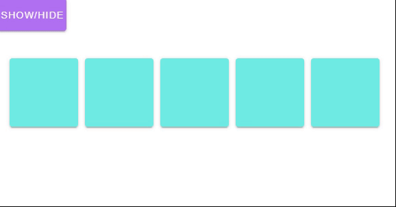

---
tags:
  - animation
  - ui
  - element
---
# TransitionGroup

## Detailed description
The transition allows you to associate with a list of items we want to render simultaneously, for example with <b>modelFor</b> animation for different events.

## Example usage
The following example shows the simplest usage of the TransitionGroup type.



<code-group>
<code-block title=".at" active>
```scss
Item{ 
  id: "example",
  anchors.right: 0,
  anchors.left: 0,
  anchors.top: 0,
  anchors.bottom: 0,
  child: [
    Button{
      id: "buttonexample1",
      width: 100,
      height: 47,
      x: 0,
      y: 0,
      color: "#fff",
      backgroundColor: "#b271f3",
      dark: true,
      onClicked: "showed = !showed",
      value: "Show/Hide"
    },
    TransitionGroup{
      id: "transitionexample3",
      width: 271,
      height: 222,
      x: 17,
      y: 65,
      child: [
        Card{
          id: "cardtransitionexample3111111",
          width: 100,
          height: 100,
          x: "<#index * 110#>",
          y: 22,
          color: "#70ece4",
          modelIf: "showed",
          modelFor: "5"
        }
      ],
      leaveActiveClass: "animated slideInUp",
      enterActiveClass: "animated rotateOut"
    }
  ]
}
```
</code-block>

<code-block title=".atObj">
```js
Data showed = true
```
</code-block>

<code-block title=".atStyle">
```scss
```
</code-block>
</code-group>

## duration <Badge text="int" type="tip" vertical="middle"/>
In most cases, Artefact can automatically figure out when the transition has finished. By default, Artefact waits for the first transition's end or animation's end event on the root transition element. However, this may not always be desired - for example, we may have a choreographed transition sequence where some nested inner elements have a delayed transition or a longer transition duration than the root transition element.
In such cases you can specify an explicit transition duration (in milliseconds) using the duration property.

## name <Badge text="String" type="tip" vertical="middle"/>
The name of the main transition.

## appear <Badge text="bool" type="tip" vertical="middle"/>
If you also want to apply a transition on the initial render of a node, you can add the appear attribute.

## appearActiveClass <Badge text="string" type="tip" vertical="middle"/>


## appearToClass <Badge text="String" type="tip" vertical="middle"/>


## appearClass <Badge text="String" type="tip" vertical="middle"/>


## enterActiveClass <Badge text="String" type="tip" vertical="middle"/>
Active state for enter. Applied during the entire entering phase. Added before element is inserted, removed when transition/animation finishes. This class can be used to define the duration, delay and easing curve for the entering transition.

## enterToClass <Badge text="String" type="tip" vertical="middle"/>
Ending state for enter. Added one frame after element is inserted (at the same time enterClass is removed), removed when transition/animation finishes.

## enterClass <Badge text="String" type="tip" vertical="middle"/>
Starting state for enter. Added before element is inserted, removed one frame after element is inserted.

## leaveClass <Badge text="String" type="tip" vertical="middle"/>
Starting state for leave. Added immediately when a leaving transition is triggered, removed after one frame.

## leaveActiveClass <Badge text="String" type="tip" vertical="middle"/>
Active state for leave. Applied during the entire leaving phase. Added immediately when leave transition is triggered, removed when the transition/animation finishes. This class can be used to define the duration, delay and easing curve for the leaving transition.

## leaveToClass <Badge text="String" type="tip" vertical="middle"/>
Ending state for leave. Added one frame after a leaving transition is triggered (at the same time leaveClass is removed), removed when the transition/animation finishes.

::: tip Note
transition classes will be applied to inner elements and not to the group/container itself.
:::

::: warning
Transition modes are not available, because we are no longer alternating between mutually exclusive elements.
:::
