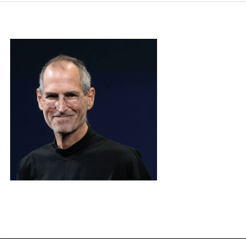

---
tags:
  - basic
  - ui
  - element
---
# Image

## Detailed description
The Image type displays an image. The source of the image is specified as a URL using the source property. Images can be supplied in any of the standard image formats supported by Artefact, including bitmap formats such as PNG and JPEG, and vector graphics formats such as SVG. If you need to display animated images, use AnimatedImage.

If the width and height properties are not specified, the Image automatically uses the size of the loaded image. By default, specifying the width and height of the item causes the image to be scaled to that size.

## Example usage
The following example shows the simplest usage of the Image type.



<code-group>
<code-block title=".at" active>
```scss
Image{  
  id: "example",
  width: 246,
  height: 237,
  x: 19,
  y: 62,
  source: "Resources/steve.jobs.jpg"
}
```
</code-block>

<code-block title=".atObj">
```js
```
</code-block>

<code-block title=".atStyle">
```scss
```
</code-block>
</code-group>

## source <Badge text="url" type="tip" vertical="middle"/>
Image can handle any image format supported by At, loaded from any URL scheme supported by At. The URL may be relative to the base URL of the project.

## border <Badge text="int" type="tip" vertical="middle"/>
The border and borderColor used to draw the border of the image. A border of 1 creates a thin line. For no line, use a width of 0 or a transparent color. Note: The width of the image's border does not affect the geometry of the image. The border is rendered within the image's boundaries.

## borderColor <Badge text="color" type="tip" vertical="middle"/>
The border and borderColor used to draw the border of the image. A border of 1 creates a thin line. For no line, use a width of 0 or a transparent color. Note: The width of the image's border does not affect the geometry of the image. The border is rendered within the image's boundaries.

## radius <Badge text="int" type="tip" vertical="middle"/>
This property holds the corner radius used to draw a rounded image. If radius is non-zero, the image will be painted as a rounded image, otherwise it will be painted as a normal image. The same radius is used by all 4 corners; there is currently no way to specify different radius for different corners.


<code-group>
<code-block title=".at" active>
```scss{9}
Image{  
  id: "example",
  width: 246,
  height: 237,
  x: 19,
  y: 62,
  source: "Resources/steve.jobs.jpg",
  border: 5,
  radius: 8,
  borderColor: "#5167b1"
}
```
</code-block>

<code-block title=".atObj">
```js
```
</code-block>

<code-block title=".atStyle">
```scss
```
</code-block>
</code-group>

## repeat <Badge text="bool" type="tip" vertical="middle"/>
Set this property to define what happens when the source image has a different size than the item.
