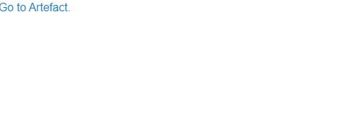

---
tags:
  - basic
  - ui
  - element
---
# Link

## Detailed description
The Link allow you to set a connection to another page / Anchors.

## Example usage
The following example shows the simplest usage of the Link type.



<code-group>
<code-block title=".at" active>
```scss
Item{  
  id: "example",
  width: 246,
  height: 58,
  x: 0,
  y: 0,
  child: [
    Link{     
      id: "linkexample1",
      width: 200,
      height: 31,
      child: [
        Text{         
          id: "textlinkexample11",
          width: "auto",
          height: "auto",
          value: "Go to Artefact."
        }
      ],
      to: "https://artefact-labs.com/"
    }
  ]
}
```
</code-block>

<code-block title=".atObj">
```js
```
</code-block>

<code-block title=".atStyle">
```scss
```
</code-block>
</code-group>

## to <Badge text="url(string)" type="tip" vertical="middle"/>
The url of the link.