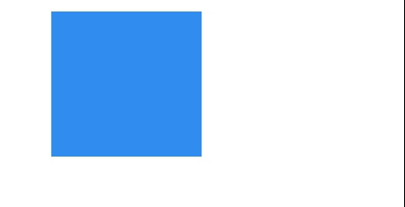

---
tags:
  - basic
  - ui
  - element
---
# Rectangle

## Detailed description
Rectangle items are used to fill areas with solid color or gradients, and/or to provide a rectangular border.
Each Rectangle item is painted using either a solid fill color, specified using the color property, or a gradient, defined using a Gradient type and set using the gradient property. If both a color and a gradient are specified, the gradient is used.

You can add an optional border to a rectangle with its own color and thickness by setting the borderColor and border properties. Set the color to "transparent" to paint a border without a fill color.

You can also create rounded rectangles using the radius property.

## Example usage
The following example shows the simplest usage of the Rectangle type.



<code-group>
<code-block title=".at" active>
```scss
Rectangle{  
  id: "exampleRectangle",
  width: 170,
  height: 164,
  x: 60,
  y: 13,
  color: "#328ef1"
}
```
</code-block>

<code-block title=".atObj">
```js
```
</code-block>

<code-block title=".atStyle">
```scss
```
</code-block>
</code-group>

## color <Badge text="color" type="tip" vertical="middle"/>
This property holds the color used to fill the rectangle. The default color is transparent.

## gradiant <Badge text="bool" type="tip" vertical="middle"/>
This property defines if the rectangle will be fill with the gradient or not.

## firstColor <Badge text="color" type="tip" vertical="middle"/>
This define the first color of the gradiant.

## secondColor <Badge text="color" type="tip" vertical="middle"/>
This define the second color of the gradiant.

## gradiantAngle <Badge text="int(deg)" type="tip" vertical="middle"/>
This define the angle of the gradiant. It is the angle of the line between the first- and secondColor.

## border <Badge text="int" type="tip" vertical="middle"/>
The border and borderColor used to draw the border of the rectangle. A border of 1 creates a thin line. For no line, use a border of 0 or a transparent color. Note: The border of the rectangle's border does not affect the geometry of the rectangle. The border is rendered within the rectangle's boundaries.

## borderColor <Badge text="color" type="tip" vertical="middle"/>
The border and borderColor used to draw the border of the rectangle. A border of 1 creates a thin line. For no line, use a border of 0 or a transparent color. Note: The border of the rectangle's border does not affect the geometry of the rectangle. The border is rendered within the rectangle's boundaries.

## radius <Badge text="int" type="tip" vertical="middle"/>
This property holds the corner radius used to draw a rounded rectangle. If radius is non-zero, the rectangle will be painted as a rounded rectangle, otherwise it will be painted as a normal rectangle. The same radius is used by all 4 corners; there is currently no way to specify different radius for different corners.

<code-group>
<code-block title=".at" active>
```scss{11}
Rectangle{  
  id: "exampleRectangle",
  width: 170,
  height: 164,
  x: 60,
  y: 13,
  gradiant: true,
  firstColor: "#704ce5",
  secondColor: "#1ee2cb",
  border: 2,
  borderColor: "#c608bd",
  radius: 5
}
```
</code-block>

<code-block title=".atObj">
```js
```
</code-block>

<code-block title=".atStyle">
```scss
```
</code-block>
</code-group>
