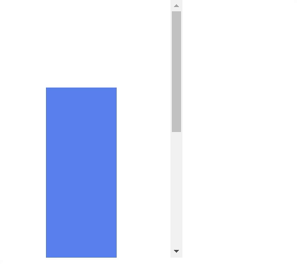

---
tags:
  - basic
  - ui
  - element
---
# ScrollArea

## Detailed description
ScrollArea provides scrolling for user-defined content.

## Example usage
The following example shows the simplest usage of the ScrollArea type.



<code-group>
<code-block title=".at" active>
```scss
ScrollArea{  
  id: "exampleScroll",
  width: 260,
  height: 366,
  x: 0,
  anchors.top: 0,
  child: [
    Rectangle{
     
      id: "rectangleexampleScroll1",
      width: 100,
      height: 584,
      x: 67,
      y: 125,
      color: "#5981ee"
    }
  ],
  overflow: "hidden",
  overflowY: "scroll"
}
```
</code-block>

<code-block title=".atObj">
```js
```
</code-block>

<code-block title=".atStyle">
```scss
```
</code-block>
</code-group>

## Property Documentation
ScrollView have all the property of the Rectangle and another like:

## overflow <Badge text="bool" type="tip" vertical="middle"/>
Activate the textOverflow.

## overflowX <Badge text="Enum" type="tip" vertical="middle"/>
This property defines the way the overflow will be display in the horizontal.

## overflowY <Badge text="Enum" type="tip" vertical="middle"/>
This property defines the way the overflow will be display in the vertical.

## styleMode <Badge text="int" type="tip" vertical="middle"/>
This property enables you to select the custum style you want. 0 is for the normal (default) style. You have a choice from 1 to 15.

## barWidth <Badge text="int" type="tip" vertical="middle"/>
Define the width/height of the scrollbar.

## barBackgroundColor <Badge text="string" type="tip" vertical="middle"/>
Define the color to be set on the background of the scrollbar.

## barColor <Badge text="string" type="tip" vertical="middle"/>
Define the color of the background.

## color <Badge text="color" type="tip" vertical="middle"/>
This property holds the color used to fill the rectangle. The default color is transparent.

## gradiant <Badge text="bool" type="tip" vertical="middle"/>
This property defines if the rectangle will be fill with the gradient or not.

## firstColor <Badge text="color" type="tip" vertical="middle"/>
This define the first color of the gradiant.

## secondColor <Badge text="color" type="tip" vertical="middle"/>
This define the second color of the gradiant.

## gradiantAngle <Badge text="int(deg)" type="tip" vertical="middle"/>
This define the angle of the gradiant. It is the angle of the line between the first- and secondColor.

## border <Badge text="int" type="tip" vertical="middle"/>
The border and borderColor used to draw the border of the rectangle. A border of 1 creates a thin line. For no line, use a border of 0 or a transparent color. Note: The border of the rectangle's border does not affect the geometry of the rectangle. The border is rendered within the rectangle's boundaries.

## borderColor <Badge text="color" type="tip" vertical="middle"/>
The border and borderColor used to draw the border of the rectangle. A border of 1 creates a thin line. For no line, use a border of 0 or a transparent color. Note: The border of the rectangle's border does not affect the geometry of the rectangle. The border is rendered within the rectangle's boundaries.

## radius <Badge text="int" type="tip" vertical="middle"/>
This property holds the corner radius used to draw a rounded rectangle. If radius is non-zero, the rectangle will be painted as a rounded rectangle, otherwise it will be painted as a normal rectangle. The same radius is used by all 4 corners; there is currently no way to specify different radius for different corners.
