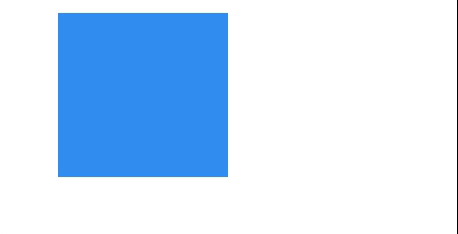

---
tags:
  - game
  - ui
  - element
---
# Rectangle

## Detailed description
The Rectangle Shape is a Game Object that can be added to a Scene, Group or Container. You can treat it like any other Game Object in your game, such as tweening it, scaling it, or enabling it for input or physics. It provides a quick and easy way for you to render this shape in your game without using a texture, while still taking advantage of being fully batched in WebGL.
This shape supports both fill and stroke colors.
You can change the size of the rectangle by changing the width and height properties.

## Example usage
The following example shows the simplest usage of the Rectangle type.



<code-group>
<code-block title=".at" active>
```scss
Rectangle{  
  id: "exampleRectangle",
  width: 170,
  height: 164,
  x: 60,
  y: 13,
  color: "#328ef1"
}
```
</code-block>

<code-block title=".atObj">
```js
```
</code-block>

<code-block title=".atStyle">
```scss
```
</code-block>
</code-group>

## color <Badge text="color" type="tip" vertical="middle"/>
The color the rectangle will be filled with.
