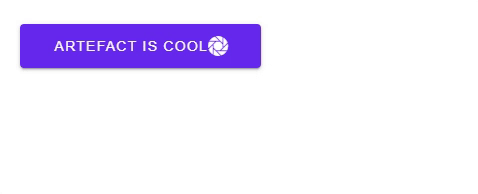

---
tags:
  - input-control
  - ui
  - element
---
# Button

## Detailed description
Button presents a push-button control that can be pushed or clicked by the user. Buttons are normally used to perform an action, or to answer a question. Typical buttons are OK, Apply, Cancel, Close, Yes, No, and Help.

## Example usage
The following example shows the simplest usage of the Button type.



<code-group>
<code-block title=".at" active>
```scss
Button{  
  id: "exampleButton",
  width: 241,
  height: 44,
  x: 22,
  y: 25,
  backgroundColor: "#6729ee",
  icon: "ion-ios-aperture",
  hasIcon: true,
  dark: true,
  value: "Artefact is cool"
}, 
```
</code-block>

<code-block title=".atObj">
```js
```
</code-block>

<code-block title=".atStyle">
```scss
```
</code-block>
</code-group>

## backgroundColor <Badge text="color" type="tip" vertical="middle"/>
define the color of the button.

## fontSize <Badge text="int" type="tip" vertical="middle"/>
Define the size of the text on the button.

## fontFamily <Badge text="string" type="tip" vertical="middle"/>
Sets the family name of the font. The family name is case insensitive and may optionally include a foundry name, e.g. **"Arial"**. If the family is available from more than one foundry and the foundry isn't specified, an arbitrary foundry is chosen. If the family isn't available a family will be set using the font matching algorithm.

## elevation <Badge text="int" type="tip" vertical="middle"/>
Set the depth of the shadow.

## dark <Badge text="bool" type="tip" vertical="middle"/>
When the color of the button dark is, set this to true will change the color of the text on the Button to white.

## onClicked <Badge text="signal(JS)" type="tip" vertical="middle"/>
This signal is emitted when the button is interactively clicked by the user via touch, mouse, or keyboard.

## value <Badge text="string" type="tip" vertical="middle"/>
The text to display.

## icon <Badge text="string" type="tip" vertical="middle"/>
The name of the icon to display.

## depressed <Badge text="bool" type="tip" vertical="middle"/>

## fab <Badge text="bool" type="tip" vertical="middle"/>

## flat <Badge text="bool" type="tip" vertical="middle"/>

## outline <Badge text="bool" type="tip" vertical="middle"/>

## rounded <Badge text="bool" type="tip" vertical="middle"/>

## tile <Badge text="bool" type="tip" vertical="middle"/>

## disable <Badge text="bool" type="tip" vertical="middle"/>

## loading <Badge text="bool" type="tip" vertical="middle"/>

## onlyIcon <Badge text="bool" type="tip" vertical="middle"/>

## hasIcon <Badge text="bool" type="tip" vertical="middle"/>

## iconLeft <Badge text="bool" type="tip" vertical="middle"/>

## color <Badge text="color" type="tip" vertical="middle"/>
