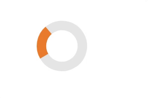

---
tags:
  - input-control
  - ui
  - element
---
# CircularProgress

## Detailed description
The CircularProgress is used to give an indication of the progress of an operation. value is updated regularly and must be between minimum value and maximum value.

## Example usage
The following example shows the simplest usage of the CircularProgress type.



<code-group>
<code-block title=".at" active>
```scss
CircularProgress{  
  id: "example",
  width: 100,
  height: 100,
  x: 76,
  y: 43,
  color: "#ea7c2d",
  value: 22,
  size: 6,
  rotateBar: 150
}
```
</code-block>

<code-block title=".atObj">
```js
```
</code-block>

<code-block title=".atStyle">
```scss
```
</code-block>
</code-group>

## value <Badge text="int" type="tip" vertical="middle"/>
The current value of the progression.

## size <Badge text="int" type="tip" vertical="middle"/>
Define how big the colored bar will be.

## color <Badge text="color" type="tip" vertical="middle"/>
Define the color of the progress.

## indetermined <Badge text="bool" type="tip" vertical="middle"/>
Set the progression to undefined and display a loop.

## rotate <Badge text="bool" type="tip" vertical="middle"/>
Rotates the circle start point in deg.
