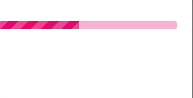

---
tags:
  - input-control
  - ui
  - element
---
# LinearProgress

## Detailed description
The LinearProgress is used to give an indication of the progress of an operation. value is updated regularly and must be between minimum value and maximum value.

## Example usage
The following example shows the simplest usage of the LinearProgress type.



<code-group>
<code-block title=".at" active>
```scss
LinearProgress{  
  id: "example",
  width: 353,
  height: 16,
  x: 0,
  y: 44,
  value: 45,
  color: "#e10c6c",
  striped: true,
  rounded: true
}
```
</code-block>

<code-block title=".atObj">
```js
```
</code-block>

<code-block title=".atStyle">
```scss
```
</code-block>
</code-group>

## value <Badge text="int" type="tip" vertical="middle"/>
The current value of the progression.

## color <Badge text="color" type="tip" vertical="middle"/>
Define the color of the progress.

## backgroundOpacity <Badge text="int" type="tip" vertical="middle"/>
Define how much the background of the bar will be transparent.

## indetermined <Badge text="bool" type="tip" vertical="middle"/>
Set the progression to undefined and display a loop.

## active <Badge text="bool" type="tip" vertical="middle"/>
Reduce the height to 0, hiding component.

## striped <Badge text="bool" type="tip" vertical="middle"/>
Adds a stripe background to the filled portion of the progress component.

## rounded <Badge text="bool" type="tip" vertical="middle"/>
Adds a border radius to the progress component.
