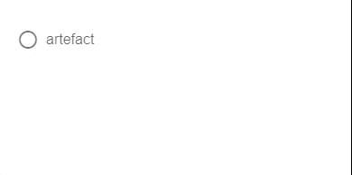

---
tags:
  - input-control
  - ui
  - element
---
# Radio

## Detailed description
A Radio is an option button that can be toggled on (checked) or off (unchecked). Checkboxes are typically used to represent features in an application that can be enabled or disabled without affecting others. The state of the checkbox can be set with the checked property.

## Example usage
The following example shows the simplest usage of the Radio type.



<code-group>
<code-block title=".at" active>
```scss
Radio{  
  id: "exampleRadio",
  width: 118,
  height: 62,
  x: 20,
  y: 15,
  checked: true,
  label: "artefact"
}
```
</code-block>

<code-block title=".atObj">
```js
```
</code-block>

<code-block title=".atStyle">
```scss
```
</code-block>
</code-group>

## label <Badge text="string" type="tip" vertical="middle"/>
Sets input label.

## color <Badge text="color" type="tip" vertical="middle"/>
Applies specified color to the control - it can be the name of material color (for example success or purple) or css color.

## checked <Badge text="bool" type="tip" vertical="middle"/>
This property set the state of the Radio.

## disabled <Badge text="bool" type="tip" vertical="middle"/>
Disable the input.

## readOnly <Badge text="bool" type="tip" vertical="middle"/>
Puts input in readonly state.

## error <Badge text="bool" type="tip" vertical="middle"/>
Puts the input in a manual error state.

## success <Badge text="bool" type="tip" vertical="middle"/>
Puts the input in a manual success state.

## indeterminate <Badge text="bool" type="tip" vertical="middle"/>
Sets an indeterminate state for the checkbox.