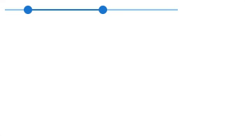

---
tags:
  - input-control
  - ui
  - element
---
# RangeSlider

## Detailed description
RangeSliders reflect a range of values along a bar, from which users may select a single value. They are ideal for adjusting settings such as volume, brightness, or applying image filters.

## Example usage
The following example shows the simplest usage of the Slider type.



<code-group>
<code-block title=".at" active>
```scss
RangeSlider{  
  id: "exampleRangeSlider",
  width: 263,
  height: 100,
  x: 0,
  y: 0,
  min: -50,
  max: 250,
  model: "range"
}
```
</code-block>

<code-block title=".atObj">
```js
Data range = [-10, 120]
```
</code-block>

<code-block title=".atStyle">
```scss
```
</code-block>
</code-group>

## min <Badge text="int" type="tip" vertical="middle"/>
Define the minimal value of the slider.

## max <Badge text="int" type="tip" vertical="middle"/>
Define the maximal value of the slider.

## value <Badge text="int" type="tip" vertical="middle"/>
Set the current value of the Slider between the min and the max.

## color <Badge text="color" type="tip" vertical="middle"/>
Define the color of the RangeSlider.

## trackColor <Badge text="color" type="tip" vertical="middle"/>
Define the color of the track if it is showed.

## label <Badge text="String" type="tip" vertical="middle"/>
It is the text wich will be show near the slider (right or left (default)).

## inverseLabel <Badge text="bool" type="tip" vertical="middle"/>
Set the label to right.

## thumbLabel <Badge text="bool|String" type="tip" vertical="middle"/>
Define if the thumb will be show or not. You have the choice between: <b>true<b> and <b>always<b>

## thumbSize <Badge text="int" type="tip" vertical="middle"/>
Controls the size of the thumb label.

## thumbColor <Badge text="color" type="tip" vertical="middle"/>
Sets the thumb and thumb label color.

## appendIcon <Badge text="String" type="tip" vertical="middle"/>
Appends an icon to the component.

## prependIconString <Badge text="String" type="tip" vertical="middle"/>
Prepends an icon to the component.

## onAppendClickedSignal <Badge text="Signal (Js)" type="tip" vertical="middle"/>
The signal will be emitted when the append icon will be clicked

## onPrependClicked <Badge text="Signal (Js)" type="tip" vertical="middle"/>
The signal will be emitted when the append icon will be clicked.

## disable <Badge text="bool" type="tip" vertical="middle"/>
Disable the input.

## readonly <Badge text="bool" type="tip" vertical="middle"/>
Puts input in readonly state.

## vertical <Badge text="bool" type="tip" vertical="middle"/>
Changes slider direction to vertical.

## ticks <Badge text="bool" type="tip" vertical="middle"/>
Show track ticks. If true it shows ticks when using slider. If set to 'always' it always shows ticks.

## step <Badge text="int" type="tip" vertical="middle"/>
If greater than 0, sets step interval for ticks.

## tickSize <Badge text="int" type="tip" vertical="middle"/>
Controls the size of ticks.

## tickLabels <Badge text="Array" type="tip" vertical="middle"/>
When provided with Array, will attempt to map the labels to each step-in index order.

## rules <Badge text="Array" type="tip" vertical="middle"/>
Accepts an array of functions that take an input value as an argument and return either true / false or a string with an error message.