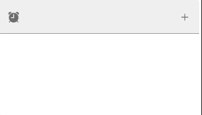

---
tags:
  - input-control
  - ui
  - element
---
# Select

## Detailed description
TextField is a single line text editor. TextField extends TextInput with a placeholder text functionality, and adds decoration.

## Example usage
The following example shows the simplest usage of the Select type.



<code-group>
<code-block title=".at" active>
```scss
Select{ 
  id: "selecttest11",
  width: 195,
  height: 100,
  x: 376,
  y: 52,
  prependIcon: "ion-ios-alarm",
  items: [
    "UI",
    "Artefact"
  ],
  mode: "filled",
  appendIcon: "ion-ios-add",
  chips: true,
  multiple: true,
  model: selected
}
```
</code-block>

<code-block title=".atObj">
```js
Data selected = null;
```
</code-block>

<code-block title=".atStyle">
```scss
```
</code-block>
</code-group>

## mode <Badge text="url(String)" type="tip" vertical="middle"/>
This property set the mode of the Select field. It could be: regular, solo, box, outline.

## prependIcon <Badge text="String" type="tip" vertical="middle"/>
Put an icon at the left of the field.

## appendIcon <Badge text="String" type="tip" vertical="middle"/>
Put an icon at the right of the field.

## label <Badge text="String" type="tip" vertical="middle"/>
The description of the field (this property is different depending to the Placeholder)

## items <Badge text="Array" type="tip" vertical="middle"/>
The possible values of the select Field.

## placeholder <Badge text="String" type="tip" vertical="middle"/>
Sets the input's placeholder text.

## chips <Badge text="bool" type="tip" vertical="middle"/>
Changes display of selections to chips.

## multiple <Badge text="bool" type="tip" vertical="middle"/>
Allow you to select multiple items.

## sloted <Badge text="bool" type="tip" vertical="middle"/>
Can be used to customize the way selected values are shown in the input. This is great when you want something like <b>foo (+20 others)<b> or don't want the selection to occupy multiple lines.

## disabled <Badge text="bool" type="tip" vertical="middle"/>
Disables the input.

## dark <Badge text="bool" type="tip" vertical="middle"/>
Applies the dark theme variant to the component.

## readOnly <Badge text="bool" type="tip" vertical="middle"/>
Puts input in readonly state.
