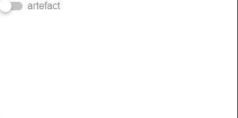

---
tags:
  - input-control
  - ui
  - element
---
# Switch

## Detailed description
Switch is an option button that can be dragged or toggled on (checked) or off (unchecked). Switches are typically used to select between two states.

## Example usage
The following example shows the simplest usage of the LinearProgress type.



<code-group>
<code-block title=".at" active>
```scss
Switch{  
  id: "exampleSwitch",
  width: 252,
  height: 100,
  x: 0,
  y: 0,
  label: "artefact",
  color: "#aaeb1d",
  checked: false
}
```
</code-block>

<code-block title=".atObj">
```js
```
</code-block>

<code-block title=".atStyle">
```scss
```
</code-block>
</code-group>

## label <Badge text="String" type="tip" vertical="middle"/>
Sets input label.

## color <Badge text="color" type="tip" vertical="middle"/>
Applies specified color to the control - it can be the name of material color (for example success or purple) or css color.

## checked <Badge text="bool" type="tip" vertical="middle"/>
This property set the state of the Switch.

## disabled <Badge text="bool" type="tip" vertical="middle"/>
Disable the input.

## readOnly <Badge text="bool" type="tip" vertical="middle"/>
Puts input in readonly state.

## error <Badge text="bool" type="tip" vertical="middle"/>
Puts the input in a manual error state.

## success <Badge text="bool" type="tip" vertical="middle"/>
Puts the input in a manual success state.

## indeterminate <Badge text="bool" type="tip" vertical="middle"/>
Sets an indeterminate state for the checkbox.

## loading <Badge text="bool" type="tip" vertical="middle"/>
Displays linear progress bar.

## inset <Badge text="bool" type="tip" vertical="middle"/>
You can make switch render in inset mode.
