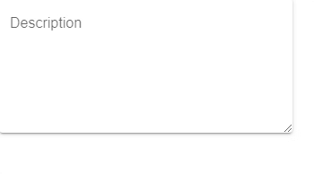

---
tags:
  - basic
  - ui
  - element
---
# TextArea

## Detailed description
The TextArea item displays a block of editable, formatted text. It can display both plain and rich text.

## Example usage
The following example shows the simplest usage of the TextArea type.



<code-group>
<code-block title=".at" active>
```scss
TextArea{  
  id: "exampleTextArea",
  width: 327,
  height: 106,
  x: 0,
  y: 0,
  mode: "solo",
  label: "Description"
}
```
</code-block>

<code-block title=".atObj">
```js
Data range = [-10, 120]
```
</code-block>

<code-block title=".atStyle">
```scss
```
</code-block>
</code-group>

## value <Badge text="String" type="tip" vertical="middle"/>
The text to display.

## horizontalAlign <Badge text="Enum" type="tip" vertical="middle"/>
Sets the horizontal and vertical alignment of the text within the TextEdit item's width and height. By default, the text alignment follows the natural alignment of the text, for example text that is read from left to right will be aligned to the left.

## verticalAlignEnum <Badge text="Enum" type="tip" vertical="middle"/>
Sets the horizontal and vertical alignment of the text within the TextEdit item's width and height. By default, the text alignment follows the natural alignment of the text, for example text that is read from left to right will be aligned to the left.

## color <Badge text="color" type="tip" vertical="middle"/>
This property holds the color used to fill the rectangle. The default color is transparent.

## fontFamilystring <Badge text="String" type="tip" vertical="middle"/>
Sets the family name of the font. The family name is case insensitive and may optionally include a foundry name, e.g. "Helvetica [Cronyx]". If the family is available from more than one foundry and the foundry isn't specified, an arbitrary foundry is chosen. If the family isn't available a family will be set using the font matching algorithm.

## fontSize <Badge text="int" type="tip" vertical="middle"/>
Sets the font size in pixels. Using this function makes the font device dependent.

## police <Badge text="Enum" type="tip" vertical="middle"/>
This property defines some styling for the Text.

## textO <Badge text="bool" type="tip" vertical="middle"/>
Activate the textOverflow

## textOverflow <Badge text="int" type="tip" vertical="middle"/>
Define the size of the overflow.
