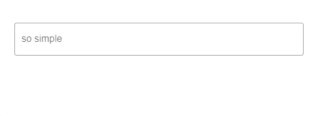

---
tags:
  - input-control
  - ui
  - element
---
# TextField

## Detailed description
TextField is a single line text editor. TextField extends TextInput with a placeholder text functionality, and adds decoration.

## Example usage
The following example shows the simplest usage of the TextField type.



<code-group>
<code-block title=".at" active>
```scss
TextField{  
  id: "exampleTextField",
  width: 483,
  height: 60,
  x: 27,
  y: 39,
  mode: "outlined",
  label: "so simple",
  fontSize: 20
}
```
</code-block>

<code-block title=".atObj">
```js
```
</code-block>

<code-block title=".atStyle">
```scss
```
</code-block>
</code-group>

## mode <Badge text="url(String)" type="tip" vertical="middle"/>
This property set the mode of the Button. It could be: regular, solo, box, outline.

## prependIcon <Badge text="String" type="tip" vertical="middle"/>
Put an icon at the left of the TextField.

## appendIcon <Badge text="String" type="tip" vertical="middle"/>
Put an icon at the right of the TextField.

## label <Badge text="String" type="tip" vertical="middle"/>
The description of the TextField (this property is different depending to the Placeholder)

## value <Badge text="String" type="tip" vertical="middle"/>
The current value of the text writed in the Field.

## placeholder <Badge text="String" type="tip" vertical="middle"/>
Sets the input's placeholder text.

## align <Badge text="bool" type="tip" vertical="middle"/>
Sets the horizontal alignment of the text within the TextEdit item's width and height. By default, the text alignment follows the natural alignment of the text, for example text that is read from left to right will be aligned to the left.

## color <Badge text="color" type="tip" vertical="middle"/>
Applies specified color to the control - it can be the name of material color (for example success or purple) or css color (#033 or rgba(255, 0, 0, 0.5)).

## fontFamily <Badge text="String" type="tip" vertical="middle"/>
Sets the family name of the font. The family name is case insensitive and may optionally include a foundry name, e.g. "Helvetica [Cronyx]". If the family is available from more than one foundry and the foundry isn't specified, an arbitrary foundry is chosen. If the family isn't available a family will be set using the font matching algorithm.

## fontSize <Badge text="int" type="tip" vertical="middle"/>
Sets the font size in pixels. Using this function makes the font device dependent.

## police <Badge text="Enum" type="tip" vertical="middle"/>
This property defines some styling for the Text.

## textO <Badge text="bool" type="tip" vertical="middle"/>
Activate the textOverflow.

## textOverflow <Badge text="int" type="tip" vertical="middle"/>
Define the size of the overflow.