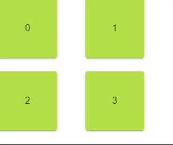

---
tags:
  - layout
  - ui
  - element
---
# Grid

## Detailed description
Grid is a type that positions its child items in grid formation. A Grid creates a grid of cells that is large enough to hold all of its child items, and places these items in the cells from left to right and top to bottom.

## Example usage
The following example shows the simplest usage of the Griid type.



<code-group>
<code-block title=".at" active>
```scss
Grid{  
  id: "example",
  width: 248,
  height: 245,
  x: 0,
  y: 0,
  child: [
    Card{     
      id: "cardexample1",
      width: 100,
      height: 100,
      color: "#b4e247",
      modelFor: "4",
      child: [
        Text{         
          id: "textcardexample11",
          width: "auto",
          height: "auto",
          anchors.verticalCenter: 0,
          anchors.horizontalCenter: 0,
          value: "<#index#>"
        }
      ]
    }
  ],
  spacing: "space-between"
}
```
</code-block>

<code-block title=".atObj">
```js
```
</code-block>

<code-block title=".atStyle">
```scss
```
</code-block>
</code-group>

## reverse <Badge text="bool" type="tip" vertical="middle"/>
Reverse the order of the item.

## spacing <Badge text="String" type="tip" vertical="middle"/>
Define how the space between the child element will be placed.
