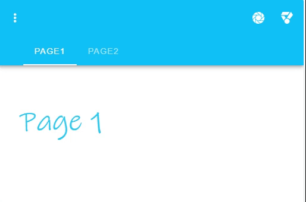

---
tags:
  - navigation
  - ui
  - element
---
# AppBar

## Detailed description
The AppBar component is pivotal to any graphical user interface (GUI), as it generally is the primary source of site navigation. The Appbar component works great in conjunction with a NavigationDrawer for providing site navigation in your application.

## Example usage
The following example shows the simplest usage of the AppBar type.



<code-group>
<code-block title=".at" active>
```scss
AppBar{  
  id: "example",
  child: [
    Object{    
      id: "page1NaN1",
      width: 200,
      height: 200,
      x: 0,
      y: 0,
      name: "page2"
    },
    Object{     
      id: "page1NaN3",
      width: 200,
      height: 200,
      x: 0,
      y: 0,
      name: "page3"
    }
  ],
  tabsTitle: [
    "Page1",
    "Page2"
  ],
  color: "#10c1f7",
  sliderColor: "#f7f7f7",
  anchors.left: 0,
  anchors.top: 0,
  anchors.bottom: 0,
  dark: true,
  model: "tabi",
  leftBar: [
    "ion-md-more"
  ],
  width: 513,
  rightBar: [
    "ion-ios-aperture",
    "ion-md-medal"
  ]
}
```
</code-block>

<code-block title=".atObj">
```js
Data tabi = null
```
</code-block>

<code-block title=".atStyle">
```scss
```
</code-block>
</code-group>

## tabsTitel <Badge text="array of String" type="tip" vertical="middle"/>
A list of all the title which will render in the top bar.

## icons <Badge text="array of String" type="tip" vertical="middle"/>
A list of icon name. One icon corresponds one title.

## color <Badge text="color" type="tip" vertical="middle"/>
The color of the bar.

## sliderColor <Badge text="color" type="tip" vertical="middle"/>
The color of the slider.

## iconsRight <Badge text="bool" type="tip" vertical="middle"/>
Define if all the icons will be on the right marge of the title.

## dark <Badge text="bool" type="tip" vertical="middle"/>
When the color of the top bar dark is, set this to true will change the color of all the title on the bar to white.

## centeredBar <Badge text="bool" type="tip" vertical="middle"/>
Define if the titles should be on the center of the bar.

## grow <Badge text="bool" type="tip" vertical="middle"/>
Force the tabs to take up all available space.

## verticalBar <Badge text="bool" type="tip" vertical="middle"/>
Stacks tabs on top of each other vertically.

## rightAlign <Badge text="bool" type="tip" vertical="middle"/>
Aligns titles to the right.

## model <Badge text="var(String)" type="tip" vertical="middle"/>
For this object it is important to define a model. Because it will be used to know every moment the current tab.

## source <Badge text="url(String)" type="tip" vertical="middle"/>
Specifies an image as the component's background.

## elevationOnScroll <Badge text="bool" type="tip" vertical="middle"/>
Elevates the AppBar when scrolling

## hideOnScroll <Badge text="bool" type="tip" vertical="middle"/>
Hide the AppBar when scrolling.

## fadeOnScroll <Badge text="bool" type="tip" vertical="middle"/>
A list of all the title which will render in the top bar.

## fadeImageOnScroll <Badge text="bool" type="tip" vertical="middle"/>
When using the source prop, will fade the image when scrolling.

## collapse <Badge text="bool" type="tip" vertical="middle"/>
Put the ToolBar into a collapsed state reducing its maximum width.

## collapseOnScroll <Badge text="bool" type="tip" vertical="middle"/>
Put the ToolBar into collapsed state when scrolling.

## extends <Badge text="bool" type="tip" vertical="middle"/>
Use this prop to increase the height of the toolbar.

## prominent <Badge text="bool" type="tip" vertical="middle"/>
Increases the height of the toolbar content to 128px.

## leftBar <Badge text="array of String" type="tip" vertical="middle"/>
A list of all the icons which will be render in the left of the bar.

## rightBar <Badge text="array of String" type="tip" vertical="middle"/>
A list of all the icons which will be render in the right of the bar.

## leftClick <Badge text="array of String" type="tip" vertical="middle"/>
A list of signals in which each signal is associated with one of the buttons defined in leftBar.

## rightClick <Badge text="array of String" type="tip" vertical="middle"/>
A list of signals in which each signal is associated with one of the buttons defined in rightBar.

::: warning
You have to always bind the model with a Data variable. It allows the system to know which tab is currently activated.
:::
