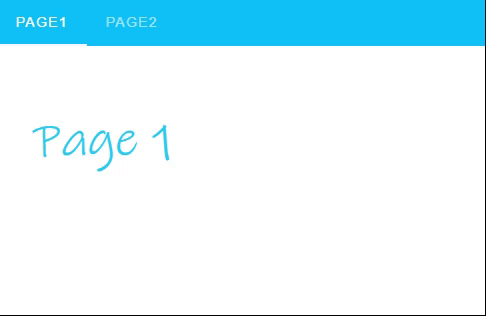

---
tags:
  - navigation
  - ui
  - element
---
# TabNavigation

## Detailed description
The TabNavigation component is used for hiding content behind a selectable item. This can also be used as a pseudo-navigation for a page.

## Example usage
The following example shows the simplest usage of the TabNavigation type.



<code-group>
<code-block title=".at" active>
```scss
TabNavigation{  
  id: "example",
  child: [
    Object{     
      id: "page1NaN1",
      width: 200,
      height: 200,
      x: 0,
      y: 0,
      name: "page2"
    },
    Object{     
      id: "page1NaN3",
      width: 200,
      height: 200,
      x: 0,
      y: 0,
      name: "page3"
    }
  ],
  tabsTitle: [
    "Page1",
    "Page2"
  ],
  color: "#10c1f7",
  sliderColor: "#f7f7f7",
  anchors.right: 0,
  anchors.left: 0,
  anchors.top: 0,
  anchors.bottom: 0,
  dark: true,
  model: "tabi"
}
```
</code-block>

<code-block title=".atObj">
```js
Data tabi = null
```
</code-block>

<code-block title=".atStyle">
```scss
```
</code-block>
</code-group>

## tabsTitel <Badge text="array of String" type="tip" vertical="middle"/>
The list of the title for every tabs.

## icons <Badge text="array of String" type="tip" vertical="middle"/>
The list of the icon for each tab.

## color <Badge text="color" type="tip" vertical="middle"/>
The color of the top bar.

## sliderColor <Badge text="color" type="tip" vertical="middle"/>
The color of the slider.

## iconsRight <Badge text="bool" type="tip" vertical="middle"/>
Put the icon of all tab to right (left per default).

## dark <Badge text="bool" type="tip" vertical="middle"/>
Applies the dark theme variant to the component.

## centeredBar <Badge text="bool" type="tip" vertical="middle"/>
Centers the tabs.

## grow <Badge text="bool" type="tip" vertical="middle"/>
Force the tabs to take up all available space.

## verticalBar <Badge text="bool" type="tip" vertical="middle"/>
Stacks tabs on top of each other vertically.

## rightAlign <Badge text="bool" type="tip" vertical="middle"/>
Aligns tabs to the right.

## model <Badge text="var(String)" type="tip" vertical="middle"/>
For this object it is important to define a model. Because it will be used to know every moment the current tab.

::: warning
You have to always bind the model with a Data variable. It allows the system to know which tab is currently activated.
:::
