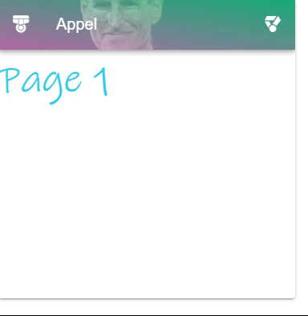

---
tags:
  - navigation
  - ui
  - element
---
# ToolBar

## Detailed description
The ToolBar component is pivotal to any graphical user interface (GUI), as it generally is the primary source of site navigation. The Appbar component works great in conjunction with a NavigationDrawer for providing site navigation in your application.

## Example usage
The following example shows the simplest usage of the ToolBar type.



<code-group>
<code-block title=".at" active>
```scss
Item{  
  id: "NaN",
  width: 697,
  height: 495,
  x: 0,
  y: 0,
  child: [
    ToolBar{    
      id: "NaN11111",
      width: 389,
      height: 339,
      x: 0,
      y: 0,
      child: [
        Object{        
          id: "page2NaN1",
          width: 100,
          height: 100,
          x: 0,
          y: 0,
          name: "page2"
        }
      ],
      leftBar: [
        "ion-md-medal"
      ],
      color: "#48b2eb",
      rightBar: [
        "ion-ios-medal"
      ],
      dark: true,
      source: "Resources/steve.jobs.jpg",
      extend: true,
      title: "Appel",
      firstColor: "#d9ef0d",
      secondColor: "#ea866d"
    }
  ]
}
```
</code-block>

<code-block title=".atObj">
```js
```
</code-block>

<code-block title=".atStyle">
```scss
```
</code-block>
</code-group>

## color <Badge text="color" type="tip" vertical="middle"/>
The color of the bar.

## dark <Badge text="bool" type="tip" vertical="middle"/>
When the color of the top bar dark is, set this to true will change the color of all the title on the bar to white.

## source <Badge text="url(String)" type="tip" vertical="middle"/>
Specifies an image as the component's background.

## elevationOnScroll <Badge text="bool" type="tip" vertical="middle"/>
Elevates the AppBar when scrolling

## hideOnScroll <Badge text="bool" type="tip" vertical="middle"/>
Hide the AppBar when scrolling.

## fadeOnScroll <Badge text="bool" type="tip" vertical="middle"/>
A list of all the title which will render in the top bar.

## fadeImageOnScroll <Badge text="bool" type="tip" vertical="middle"/>
When using the source prop, will fade the image when scrolling.

## collapse <Badge text="bool" type="tip" vertical="middle"/>
Put the ToolBar into a collapsed state reducing its maximum width.

## collapseOnScroll <Badge text="bool" type="tip" vertical="middle"/>
Put the ToolBar into collapsed state when scrolling.

## extends <Badge text="bool" type="tip" vertical="middle"/>
Use this prop to increase the height of the toolbar.

::: warning
You have to always bind the model with a Data variable. It allows the system to know which tab is currently activated.
:::
