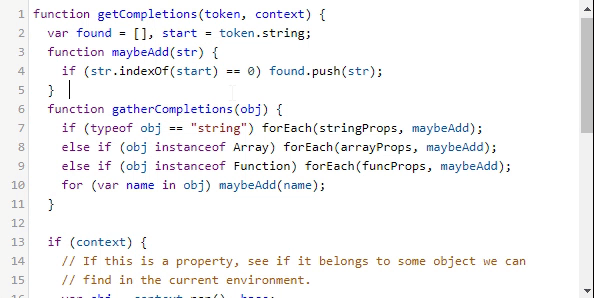

---
tags:
  - special
  - ui
  - element
  - editor
  - IDE
  - syntax coloration
---
# CodeMirror

## Detailed description
CodeMirror is a versatile text editor implemented in JavaScript for the browser. It is specialized for editing code, and comes with a number of language modes and addons that implement more advanced editing functionality.

A rich programming API and a CSS theming system are available for customizing CodeMirror to fit your application, and extending it with new functionality.

For more details look at the [official documentation page](https://codemirror.net/)

## Example usage
The following example shows the simplest usage of the CodeMirror object.



<code-group>
<code-block title=".at" active>
```scss
Codemirror{
  id: "editor",
  right: 0,
  left: 0,
  top: 0,
  bottom: 0,
  model: "<#code#>",
  options: "<#options#>",
  onInput: "<#updateCode#>"
}
```
</code-block>

<code-block title=".atObj">
```js
Data code = "";

Data options = {
  tabSize: 4,
  styleActiveLine: true,
  lineNumbers: true,
  line: true,
  mode: 'abccode',
  lineWrapping: true,
  theme: 'default'
}

Method updateCode(e){
	this.$emit('updateCode',e);
}
```
</code-block>

<code-block title=".atStyle">
```scss
```
</code-block>
</code-group>

## value <Badge text="string" type="tip" vertical="middle"/>
The text or code to display.

## options <Badge text="string" type="tip" vertical="middle"/>
Both the CodeMirror function and its fromTextArea method take as second (optional) argument an object containing configuration options. Any option not supplied like this will be taken from CodeMirror.defaults, an object containing the default options. You can update this object to change the defaults on your page.

Options are not checked in any way, so setting bogus option values is bound to lead to odd errors.

These are the supported options:

- value: string|CodeMirror.Doc
The starting value of the editor. Can be a string, or a document object.

- mode: string|object
The mode to use. When not given, this will default to the first mode that was loaded. It may be a string, which either simply names the mode or is a MIME type associated with the mode. The value "null" indicates no highlighting should be applied. Alternatively, it may be an object containing configuration options for the mode, with a name property that names the mode (for example {name: "javascript", json: true}). The demo pages for each mode contain information about what configuration parameters the mode supports. You can ask CodeMirror which modes and MIME types have been defined by inspecting the CodeMirror.modes and CodeMirror.mimeModes objects. The first maps mode names to their constructors, and the second maps MIME types to mode specs.

- lineSeparator: string|null
Explicitly set the line separator for the editor. By default (value null), the document will be split on CRLFs as well as lone CRs and LFs, and a single LF will be used as line separator in all output (such as getValue). When a specific string is given, lines will only be split on that string, and output will, by default, use that same separator.

- theme: string
The theme to style the editor with. You must make sure the CSS file defining the corresponding .cm-s-[name] styles is loaded (see the theme directory in the distribution). The default is "default", for which colors are included in codemirror.css. It is possible to use multiple theming classes at once—for example "foo bar" will assign both the cm-s-foo and the cm-s-bar classes to the editor.

- indentUnit: integer
How many spaces a block (whatever that means in the edited language) should be indented. The default is 2.

- smartIndent: boolean
Whether to use the context-sensitive indentation that the mode provides (or just indent the same as the line before). Defaults to true.

- tabSize: integer
The width of a tab character. Defaults to 4.

- indentWithTabs: boolean
Whether, when indenting, the first N*tabSize spaces should be replaced by N tabs. Default is false.

- electricChars: boolean
Configures whether the editor should re-indent the current line when a character is typed that might change its proper indentation (only works if the mode supports indentation). Default is true.

- specialChars: RegExp
A regular expression used to determine which characters should be replaced by a special placeholder. Mostly useful for non-printing special characters. The default is /[\u0000-\u001f\u007f-\u009f\u00ad\u061c\u200b-\u200f\u2028\u2029\ufeff\ufff9-\ufffc]/.

- specialCharPlaceholder: function(char) → Element
A function that, given a special character identified by the specialChars option, produces a DOM node that is used to represent the character. By default, a red dot (•) is shown, with a title tooltip to indicate the character code.

- direction: "ltr" | "rtl"
Flips overall layout and selects base paragraph direction to be left-to-right or right-to-left. Default is "ltr". CodeMirror applies the Unicode Bidirectional Algorithm to each line, but does not autodetect base direction — it's set to the editor direction for all lines. The resulting order is sometimes wrong when base direction doesn't match user intent (for example, leading and trailing punctuation jumps to the wrong side of the line). Therefore, it's helpful for multilingual input to let users toggle this option.

- rtlMoveVisually: boolean
Determines whether horizontal cursor movement through right-to-left (Arabic, Hebrew) text is visual (pressing the left arrow moves the cursor left) or logical (pressing the left arrow moves to the next lower index in the string, which is visually right in right-to-left text). The default is false on Windows, and true on other platforms.

- keyMap: string
Configures the key map to use. The default is "default", which is the only key map defined in codemirror.js itself. Extra key maps are found in the key map directory. See the section on key maps for more information.

- extraKeys: object
Can be used to specify extra key bindings for the editor, alongside the ones defined by keyMap. Should be either null, or a valid key map value.

- configureMouse: fn(cm: CodeMirror, repeat: "single" | "double" | "triple", event: Event) → Object
Allows you to configure the behavior of mouse selection and dragging. The function is called when the left mouse button is pressed. The returned object may have the following properties:
  * unit: "char" | "word" | "line" | "rectangle" | fn(CodeMirror, Pos) → {from: Pos, to: Pos}
  The unit by which to select. May be one of the built-in units or a function that takes a position and returns a range around that, for a custom unit. The default is to return "word" for double clicks, "line" for triple clicks, "rectangle" for alt-clicks (or, on Chrome OS, meta-shift-clicks), and "single" otherwise.
  * extend: bool
  Whether to extend the existing selection range or start a new one. By default, this is enabled when shift clicking.
  * addNew: bool
  When enabled, this adds a new range to the existing selection, rather than replacing it. The default behavior is to enable this for command-click on Mac OS, and control-click on other platforms.
  * moveOnDrag: bool
  When the mouse even drags content around inside the editor, this controls whether it is copied (false) or moved (true). By default, this is enabled by alt-clicking on Mac OS, and ctrl-clicking elsewhere.

- lineWrapping: boolean
Whether CodeMirror should scroll or wrap for long lines. Defaults to false (scroll).

- lineNumbers: boolean
Whether to show line numbers to the left of the editor.

- firstLineNumber: integer
At which number to start counting lines. Default is 1.

- lineNumberFormatter: function(line: integer) → string
A function used to format line numbers. The function is passed the line number, and should return a string that will be shown in the gutter.

- gutters: array(string | {className: string, style: ?string})
Can be used to add extra gutters (beyond or instead of the line number gutter). Should be an array of CSS class names or class name / CSS string pairs, each of which defines a width (and optionally a background), and which will be used to draw the background of the gutters. May include the CodeMirror-linenumbers class, in order to explicitly set the position of the line number gutter (it will default to be to the right of all other gutters). These class names are the keys passed to setGutterMarker.

- fixedGutter: boolean
Determines whether the gutter scrolls along with the content horizontally (false) or whether it stays fixed during horizontal scrolling (true, the default).

- scrollbarStyle: string
Chooses a scrollbar implementation. The default is "native", showing native scrollbars. The core library also provides the "null" style, which completely hides the scrollbars. Addons can implement additional scrollbar models.

- coverGutterNextToScrollbar: boolean
When fixedGutter is on, and there is a horizontal scrollbar, by default the gutter will be visible to the left of this scrollbar. If this option is set to true, it will be covered by an element with class CodeMirror-gutter-filler.

- inputStyle: string
Selects the way CodeMirror handles input and focus. The core library defines the "textarea" and "contenteditable" input models. On mobile browsers, the default is "contenteditable". On desktop browsers, the default is "textarea". Support for IME and screen readers is better in the "contenteditable" model. The intention is to make it the default on modern desktop browsers in the future.

- readOnly: boolean|string
This disables editing of the editor content by the user. If the special value "nocursor" is given (instead of simply true), focusing of the editor is also disallowed.

- screenReaderLabel: string
This label is read by the screenreaders when CodeMirror text area is focused. This is helpful for accessibility.

- showCursorWhenSelecting: boolean
Whether the cursor should be drawn when a selection is active. Defaults to false.

- lineWiseCopyCut: boolean
When enabled, which is the default, doing copy or cut when there is no selection will copy or cut the whole lines that have cursors on them.

- pasteLinesPerSelection: boolean
When pasting something from an external source (not from the editor itself), if the number of lines matches the number of selection, CodeMirror will by default insert one line per selection. You can set this to false to disable that behavior.

- selectionsMayTouch: boolean
Determines whether multiple selections are joined as soon as they touch (the default) or only when they overlap (true).

- undoDepth: integer
The maximum number of undo levels that the editor stores. Note that this includes selection change events. Defaults to 200.

- historyEventDelay: integer
The period of inactivity (in milliseconds) that will cause a new history event to be started when typing or deleting. Defaults to 1250.

- tabindex: integer
The tab index to assign to the editor. If not given, no tab index will be assigned.

- autofocus: boolean
Can be used to make CodeMirror focus itself on initialization. Defaults to off. When fromTextArea is used, and no explicit value is given for this option, it will be set to true when either the source textarea is focused, or it has an autofocus attribute and no other element is focused.

- phrases: ?object
Some addons run user-visible strings (such as labels in the interface) through the phrase method to allow for translation. This option determines the return value of that method. When it is null or an object that doesn't have a property named by the input string, that string is returned. Otherwise, the value of the property corresponding to that string is returned.
Below this a few more specialized, low-level options are listed. These are only useful in very specific situations, you might want to skip them the first time you read this manual.

- dragDrop: boolean
Controls whether drag-and-drop is enabled. On by default.

- allowDropFileTypes: array(string)
When set (default is null) only files whose type is in the array can be dropped into the editor. The strings should be MIME types, and will be checked against the type of the File object as reported by the browser.

- cursorBlinkRate: number
Half-period in milliseconds used for cursor blinking. The default blink rate is 530ms. By setting this to zero, blinking can be disabled. A negative value hides the cursor entirely.

- cursorScrollMargin: number
How much extra space to always keep above and below the cursor when approaching the top or bottom of the visible view in a scrollable document. Default is 0.

- cursorHeight: number
Determines the height of the cursor. Default is 1, meaning it spans the whole height of the line. For some fonts (and by some tastes) a smaller height (for example 0.85), which causes the cursor to not reach all the way to the bottom of the line, looks better

- singleCursorHeightPerLine: boolean
If set to true (the default), will keep the cursor height constant for an entire line (or wrapped part of a line). When false, the cursor's height is based on the height of the adjacent reference character.

- resetSelectionOnContextMenu: boolean
Controls whether, when the context menu is opened with a click outside of the current selection, the cursor is moved to the point of the click. Defaults to true.

- workTime, workDelay: number
Highlighting is done by a pseudo background-thread that will work for workTime milliseconds, and then use timeout to sleep for workDelay milliseconds. The defaults are 200 and 300, you can change these options to make the highlighting more or less aggressive.

- pollInterval: number
Indicates how quickly CodeMirror should poll its input textarea for changes (when focused). Most input is captured by events, but some things, like IME input on some browsers, don't generate events that allow CodeMirror to properly detect it. Thus, it polls. Default is 100 milliseconds.

- flattenSpans: boolean
By default, CodeMirror will combine adjacent tokens into a single span if they have the same class. This will result in a simpler DOM tree, and thus perform better. With some kinds of styling (such as rounded corners), this will change the way the document looks. You can set this option to false to disable this behavior.

- addModeClass: boolean
When enabled (off by default), an extra CSS class will be added to each token, indicating the (inner) mode that produced it, prefixed with "cm-m-". For example, tokens from the XML mode will get the cm-m-xml class.

- maxHighlightLength: number
When highlighting long lines, in order to stay responsive, the editor will give up and simply style the rest of the line as plain text when it reaches a certain position. The default is 10 000. You can set this to Infinity to turn off this behavior.

- viewportMargin: integer
Specifies the amount of lines that are rendered above and below the part of the document that's currently scrolled into view. This affects the amount of updates needed when scrolling, and the amount of work that such an update does. You should usually leave it at its default, 10. Can be set to Infinity to make sure the whole document is always rendered, and thus the browser's text search works on it. This will have bad effects on performance of big documents.

- spellcheck: boolean
Specifies whether or not spellcheck will be enabled on the input.

- autocorrect: boolean
Specifies whether or not autocorrect will be enabled on the input.

- autocapitalize: boolean
Specifies whether or not autocapitalization will be enabled on the input.

## onReady <Badge text="signal" type="tip" vertical="middle"/>
This signal is emitted when the editor is ready.

## onFocus <Badge text="signal" type="tip" vertical="middle"/>
This signal is emitted when the editor is focused.

## onInput <Badge text="signal" type="tip" vertical="middle"/>
This signal is emitted when the code is changed.
