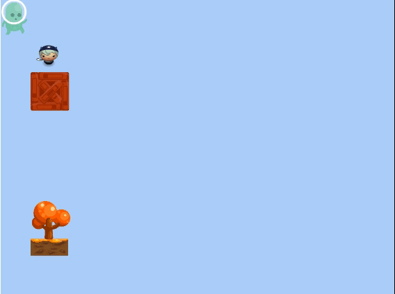

---
tags:
  - special
  - ui
  - element
---
# Game

## Detailed description
It is the main controller for the entire <b>Phaser<b> game. It is responsible for handling the boot process, parsing the configuration values, creating the renderer, and setting-up all of the global Phaser systems, such as sound and input. Once that is complete it will start the Scene Manager and then begin the main game loop.
You should generally avoid accessing any of the systems created by Game, and instead use those made available to you via the <b>Phaser.Scene<b> Systems class instead.

## Example usage
The following example shows the simplest usage of the Game type.



<code-group>
<code-block title=".at" active>
```scss
Game{  
  id: "game",
  width: 100,
  height: 100,
  x: 0,
  y: 0,
  child: [
    Object{     
      id: "scene1game1",
      width: 100,
      height: 100,
      x: 0,
      y: 0,
      name: "Scene1"
    }
  ],
  "gravityY": 300
}
```
</code-block>

<code-block title=".atObj">
```js
```
</code-block>

<code-block title=".atStyle">
```scss
```
</code-block>
</code-group>

## gravityX <Badge text="int" type="tip" vertical="middle"/>
The horizontal gravity of the world.

## gravityY <Badge text="int" type="tip" vertical="middle"/>
The vertical gravity of the world.

## debug <Badge text="bool" type="tip" vertical="middle"/>
Show a set of useful debug utilities like box, mesh etc.
