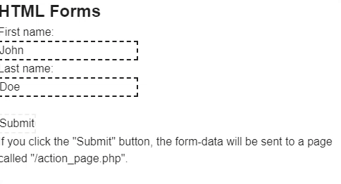

---
tags:
  - special
  - ui
  - element
---
# HtmlObject

## Detailed description
This element allows you to use and render HTML code.

## Example usage
The following example shows the simplest usage of the HtmlObject type.



<code-group>
<code-block title=".at" active>
```scss
HtmlObject{  
  id: "example",
  width: 483,
  height: 212,
  x: 0,
  y: 0,
  code: "<h2>HTML Forms</h2><form action=\"action_page.php\"> <label for=\"fname\">First name:</label><br><input type=\"text\" id=\"fname\" name=\"fname\" value=\"John\"><br> <label for=\"lname\">Last name:</label><br> <input type=\"text\" id=\"lname\" name=\"lname\" value=\"Doe\"><br><br> <input type=\"submit\" value=\"Submit\"></form><p>If you click the \"Submit\" button, the form-data will be sent to a page called \"/action_page.php\".</p>"
}
```
</code-block>

<code-block title=".atObj">
```js
```
</code-block>

<code-block title=".atStyle">
```scss
#example{
	input{
		border-style: dashed;
	}
}
```
</code-block>
</code-group>

## code <Badge text="String" type="tip" vertical="middle"/>
Your Html code to render.
