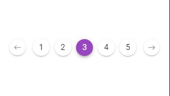

---
tags:
  - special
  - ui
  - element
---
# Pagination

## Detailed description
The **Pagination** component is used to separate long sets of data so that it is easier for a user to consume information. Depending on the length provided, the pagination component will automatically scale. To maintain the current page, simply supply a **model** attribute.

## Example usage
The following example shows the simplest usage of the Pagination type.



<code-group>
<code-block title=".at" active>
```scss
Pagination{
  id: "pagination0",
  width: 351.75,
  height: 100,
  x: 38.25,
  y: 152.25,
  model: "<#currentPage#>",
  prevIcon: "ion-ios-arrow-round-back",
  nextIcon: "ion-ios-arrow-round-forward",
  circle: true,
  color: "#9848c0",
  length: 5
}
```
</code-block>

<code-block title=".atObj">
```js
Data currentPage = 3
```
</code-block>

<code-block title=".atStyle">
```scss
```
</code-block>
</code-group>

## color <Badge text="Color" type="tip" vertical="middle"/>
It define the color that the active pages' number will take.

## length <Badge text="Integer" type="tip" vertical="middle"/>
The name of the slot, which will be used later to identify it.

## circle <Badge text="Boolean" type="tip" vertical="middle"/>
The circle prop gives you an alternate style for pagination buttons.

## prevIcon <Badge text="String" type="tip" vertical="middle"/>
Tis allow you to customize the previous-icon.

## nextIcon <Badge text="String" type="tip" vertical="middle"/>
Tis allow you to customize the next-icon.
