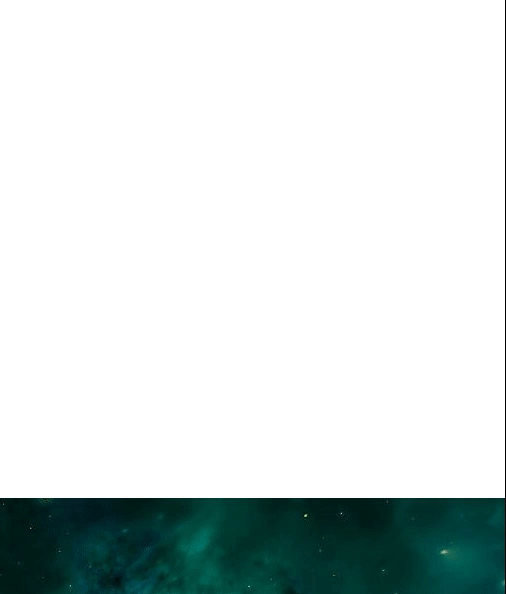

---
tags:
  - special
  - ui
  - element
---
# Parallax

## Detailed description
The Parallax component creates a 3d effect that makes an image appear to scroll slower than the window.

## Example usage
The following example shows the simplest usage of the Parallax type.



<code-group>
<code-block title=".at" active>
```scss
Item{  
  id: "example",
  height: 2000,
  y: 0,
  anchors.left: 0,
  anchors.right: 0,
  child: [
    Parallax{    
      id: "parallaxexample111111",
      height: 300,
      y: 500,
      anchors.left: 0,
      anchors.right: 0,
      source: "Resources/call-to-action-bg.jpg"
    }
  ]
}
```
</code-block>

<code-block title=".atObj">
```js
```
</code-block>

<code-block title=".atStyle">
```scss
```
</code-block>
</code-group>

## source <Badge text="url(String)" type="tip" vertical="middle"/>
Parallax can handle any image format supported by At, loaded from any URL scheme supported by At. The URL may be relative to the base URL of the project.
