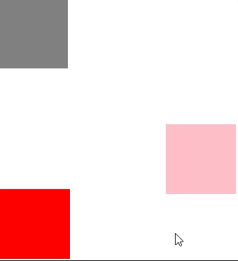

---
tags:
  - special
  - ui
  - element
---
# SlotTemplate

## Detailed description
A slotTemplate is a special element allowing to load child elements at specific places in an **Object** element.

## Example usage
The following example shows the simplest usage of the Slot type.



### Code of main.at
<code-group>
<code-block title=".at" active>
```scss
Object{
  id: "tester",
  width: 100,
  height: 100,
  x: 0,
  y: 0,
  name: "test",
  child: [
    SlotTemplate{
      id: "slottemplatetest2001",
      width: 100,
      height: 100,
      x: 0,
      y: 0,
      name: "first",
      child: [
        Rectangle{
          id: "rec1",
          width: 100,
          height: 100,
          x: 0,
          y: 0,
          color: "red"
        }
      ]
    },
    SlotTemplate{
      id: "slottemplatetest2003",
      width: 100,
      height: 100,
      x: 0,
      y: 0,
      name: "second",
      child: [
        Rectangle{
          id: "rec2",
          width: 100,
          height: 100,
          x: 0,
          y: 0,
          color: "pink"
        }
      ]
    }
  ]
}
```
</code-block>

<code-block title=".atObj">
```js
```
</code-block>

<code-block title=".atStyle">
```scss
```
</code-block>
</code-group>

### Code of test.at
<code-group>
<code-block title=".at" active>
```scss
Rectangle{
  id: "rectangle0",
  width: 453,
  height: 390,
  x: 0,
  y: 0,
  child: [
    Slot{
      id: "slotrectangle01",
      width: 126,
      height: 115,
      x: 3,
      y: 273,
      name: "first"
    },
    Slot{
      id: "slotrectangle012",
      width: 201,
      height: 199,
      x: 240,
      y: 180,
      name: "second"
    },
    Rectangle{
      id: "rectanglerectangle05",
      width: 100,
      height: 100,
      x: 0,
      y: 0,
      color: "gray"
    }
  ]
}
```
</code-block>

<code-block title=".atObj">
```js
```
</code-block>

<code-block title=".atStyle">
```scss
```
</code-block>
</code-group>

## name <Badge text="String" type="tip" vertical="middle"/>
The name of the slot, which will be used later to identify it.
