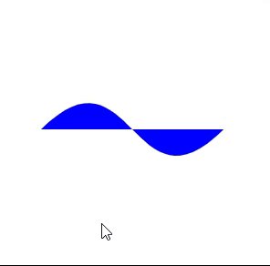

---
tags:
  - special
  - ui
  - element
---
# Svg

## Detailed description
This element is used to draw a svg on the page.

## Example usage
The following example shows the simplest usage of the Svg type.



<code-group>
<code-block title=".at" active>
```scss
Svg{
  id: "svg0",
  width: 269.75,
  height: 346.75,
  x: 56.25,
  y: 61.25,
  child: [
    SvgPath{
      id: "svgpathsvg01",
      width: 500,
      height: 500,
      d: "M 0 100 C 100 0 100 200 200 100 Z",
      closed: true,
      fill: "blue"
    }
  ]
}
```
</code-block>

<code-block title=".atObj">
```js
```
</code-block>

<code-block title=".atStyle">
```scss
```
</code-block>
</code-group>

